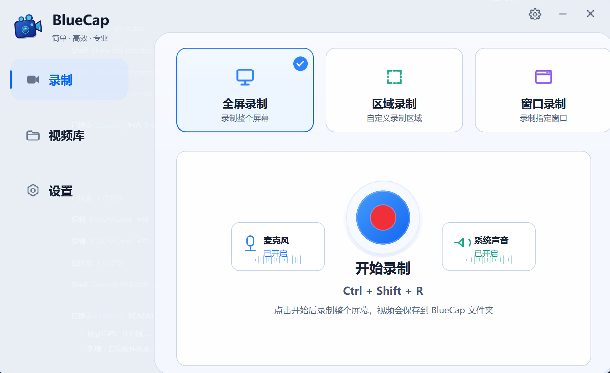
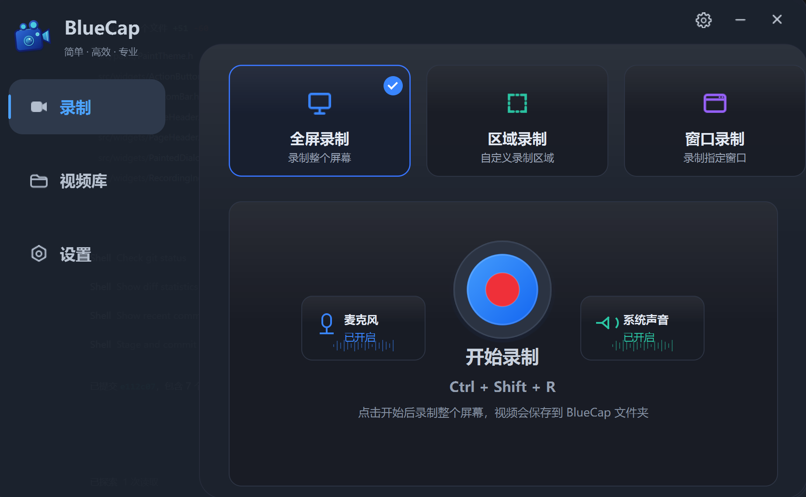

# BlueCap

 

BlueCap 是一个基于 Qt5 Widgets 的 Windows 屏幕录制工具。它支持全屏、区域和窗口录制，使用 FFmpeg 的 `gdigrab` 作为录制后端，并提供系统托盘、全局快捷键、主题切换、录制参数设置和最近视频管理。

## 技术栈

- UI：Qt5 Widgets + Qt5 SVG
- 语言：C++17
- 构建：CMake 3.16+
- 平台：Windows 10+
- 录制后端：FFmpeg `gdigrab`

## 功能

- 全屏、区域、窗口三种录制模式
- GPU 编码器自动探测，回退到 `libx264`
- 浅色/深色/跟随系统主题
- 系统托盘与全局快捷键 `Ctrl + Shift + R`
- 最近视频列表、搜索、重命名、删除和打开所在目录
- 帧率、画质、保存路径、鼠标光标、启动/停止超时等设置

## 目录结构

```text
BlueCap/
  CMakeLists.txt
  3rd/ffmpeg/              # bundled ffmpeg.exe
  resources/               # qss, icons, qrc, Windows resources
  src/
    main.cpp
    ffmpeg/                # FFmpeg 进程管理与编码器探测
    io/                    # 路径与格式化工具
    paint/                 # 自绘基础库（圆角卡片、聚焦环、渐变高光）
    recorder/              # RecorderController、录制会话
    storage/               # VideoLibrary、设置持久化
    style/                 # BlueCapStyle（QProxyStyle 全局主题）
    theme/                 # ThemeManager、ThemeColors、浅色/深色色板
    ui/                    # 页面级组件（MainWindow、Sidebar、RecordPage 等）
    utils/                 # 图标渲染、窗口拖拽、Win32 工具
    widgets/               # 自绘基础 widget（Painted*, ActionButton, ToastWidget 等）
```

## 环境要求

- Visual Studio 2017+ 工具链
- Qt 5.12+
- CMake 3.16+
- `3rd/ffmpeg/ffmpeg.exe`

如果 CMake 找不到 Qt，可显式指定路径：

```powershell
cmake -S . -B build -DCMAKE_PREFIX_PATH="D:\Qt5.13.2\5.13.2\msvc2017"
```

## 构建

```powershell
cmake -S . -B build
cmake --build build --config Debug
cmake --build build --config Release
```

构建后会把 `3rd/ffmpeg/ffmpeg.exe` 复制到可执行文件目录下。

## 自绘组件体系

所有 UI 控件均不使用原生样式，通过自绘实现统一的圆角毛玻璃设计语言：

- **paint/** — 绘制原语库（`drawCard`、`drawVerticalSheen`、`drawFocusRing`、`drawElidedText`）
- **theme/** — `ThemeColors` 定义浅色/深色两套完整色板；`ThemeManager` 负责全局主题变更通知
- **style/** — `BlueCapStyle`（`QProxyStyle`）拦截标准 Qt 控件绘制，与自绘 widget 共享同一色板
- **widgets/Painted\*** — 基础控件自绘版本（`PaintedLineEdit`、`PaintedComboBox`、`PaintedCheckBox`、`PaintedSpinBox`、`PaintedScrollBar`、`PaintedDialog`）
- **widgets/** — 业务自绘组件（`RecordModeCard`、`AudioToggleCard`、`ActionButton`、`SidebarButton`、`ToastWidget` 等）

主题切换时，`ThemeManager` 通过注册的回调逐层下发到各页面及叶子 widget。

## 录制说明

录制通过 `QProcess` 启动 FFmpeg：

```text
ffmpeg -y -f gdigrab -framerate 30 -i desktop -c:v libx264 -preset fast -pix_fmt yuv420p output.mp4
```

区域录制会使用 `-offset_x`、`-offset_y` 和 `-video_size` 限定采集范围。窗口录制会使用 `title=<window title>` 作为输入源。

## 开发辅助

格式化检查：

```powershell
cmake --build build --target format-check
```

自动格式化：

```powershell
cmake --build build --target format
```
